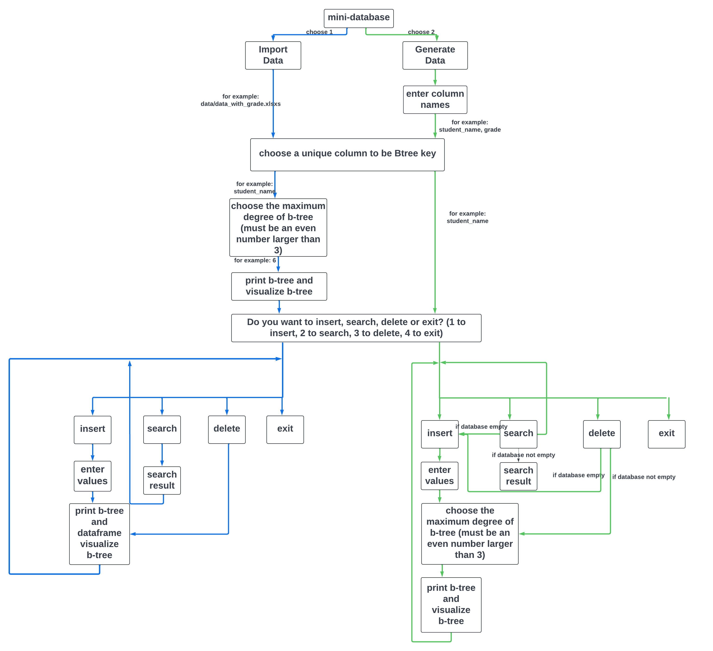

# 🌳 Mini-Database with B-Trees  
> Efficient Data Management and CRUD Operations for Student Records  

---

## 📘 Overview  

This project implements a **mini-database system using B-Trees** to manage student records efficiently.  
It was developed as part of **CS5800 (Summer 2024)** at Northeastern University under the guidance of **Professor Aanchan Mohan**.

The system supports **insertion**, **search**, and **deletion** of records, offering a hands-on demonstration of how B-Trees maintain balance and speed in large datasets.  

> **Goal:** Bridge theory and practice by implementing a working B-Tree from scratch for fast, scalable student data management.

---

## 🧩 Core Features  

### 🌱 Balanced B-Tree Implementation  
- Maintains logarithmic height with every operation.  
- Guarantees efficient data retrieval even as the dataset grows.  
- Each node dynamically holds multiple keys and children for optimal I/O performance.  

### 📂 Mini-Database System  
- Supports **Import from Excel** or **Generate from Scratch** workflows.  
- Integrates with **pandas DataFrame** for structured data handling.  
- Provides **real-time B-Tree visualization** via **NetworkX** and **Matplotlib**.  
- Allows user-defined keys and B-Tree degrees for full control.  

<p align="center">
  
</p>

---

## ⚙️ System Architecture  

### 🏧 Initialization
- The user selects a **unique key column** (e.g., `student_id` or `student_name`).
- Defines the **maximum degree (m)** of the B-Tree.  
- Data can be loaded from Excel or created manually.

### ➕ Insertion
- Uses **preemptive splitting** instead of reactive splitting for better efficiency.  
- Achieves **O(log n)** time complexity per insert operation.  

### 🔍 Search
- Implements an iterative `search_key()` method for fast lookups.  
- Returns both the node and key index, linking directly to the record in the DataFrame.  
- Logarithmic time complexity ensures stable performance.  

### ❌ Deletion
- Supports deletion of leaf and internal keys with recursive rebalancing.  
- Handles merges and redistributions while maintaining B-Tree properties.  

### 📊 Visualization
- Two-layer rendering:
  - **NetworkX** draws nodes and edges.
  - **Matplotlib** overlays labels for a clean structural display.  
- Each node’s keys are shown in blue boxes with hierarchical spacing.  

---

## 🪮 Example Workflow  

```bash
# 1️⃣ Import Data
> database_with_grade.xlsx
# Choose unique key: student_id
# Choose max degree: 6

# 2️⃣ Visualize B-Tree
> B-Tree plotted using matplotlib

# 3️⃣ Insert New Record
> Enter values for columns: ID, Name, Grade
> Record successfully inserted (O(log n) complexity)

# 4️⃣ Search Record
> Enter key to search: 12345
> Record found in 0.002s

# 5️⃣ Delete Record
> Enter key to delete: 12345
> Tree rebalanced successfully
```

---

## 📊 Performance & Comparison  

| Operation | Time Complexity | Notes |
|------------|------------------|-------|
| **Insert** | O(log n) | Preemptive splitting keeps height minimal |
| **Search** | O(log n) | Multi-key nodes minimize traversal depth |
| **Delete** | O(log n) average | Rebalancing ensures structure consistency |
| **BST (for comparison)** | O(n) worst case | Easily degrades when unbalanced |

> Compared to Binary Search Trees (BSTs), the B-Tree guarantees consistent logarithmic performance regardless of insertion order.

---

## 🧠 Key Insights  

- **Preemptive splitting** improves constant factors in insertion performance.  
- **Pandas integration** provides efficient in-memory data retrieval using `.iloc`.  
- **Visualization** plays a crucial role in debugging and validating structure.  
- **Deletion complexity** reveals the trade-off between structural balance and implementation effort.  

---

## 🧩 Future Work  

- ✏️ Add **Update** operation for record modification.  
- 🌲 Extend implementation to **B+ Tree** for improved range queries and leaf-level data management.  
- 💮 Explore **transactional scalability** and concurrent operations.  
- 🥪 Implement optimized **deletion propagation** and self-balancing routines.  

---

## 🧮 Tech Stack  

- **Python 3.10**  
- **pandas** – Data handling  
- **NetworkX & Matplotlib** – Tree visualization  
- **Jupyter Notebook** – Code testing and analysis  
- **Excel I/O** – Data import/export  

---

## 📂 Project Structure  

```
CS5800-final-project/
├── b_tree_v0.py             # Core B-Tree implementation
├── data/                    # Excel files & generated data
├── data_generation.py       # Synthetic data creation
├── read_data.py             # Data import helpers
├── mini_database.py         # Integrated CRUD interface
├── visualization/           # Matplotlib + NetworkX visualizations
└── report/                  # Final report (PDF)
```

---

## 🎓 Authors  

**Siyun He** – Insertion Logic, Data Import, Visualization  
**Bo Pang** – Deletion Logic, Error Handling  
**Jin Zhang** – Search Implementation, Analysis  

Instructor: **Prof. Aanchan Mohan**  
Course: **CS 5800 – Algorithms** (Summer 2024)

---

## 💬 Acknowledgments  

- [GeeksforGeeks: B-Tree Tutorials](https://www.geeksforgeeks.org/introduction-of-b-tree-2/)  
- [Let’s Build a Simple Database – cstack.github.io](https://cstack.github.io/db_tutorial/parts/part7.html)  
- [NetworkX Visualization Examples – Rossano Venturini](https://github.com/rossanoventurini/adsds)  

---

## 🚀 Summary  

This project turns the abstract theory of **B-Trees** into a **hands-on, interactive system** for data management.  
It demonstrates not just how B-Trees work—but how they *feel* to use: balanced, efficient, and scalable.

> “From algorithm theory to visualization — a complete learning cycle for modern data structures.”

---

🌟 **If you find this project useful, please give it a star on GitHub!**

